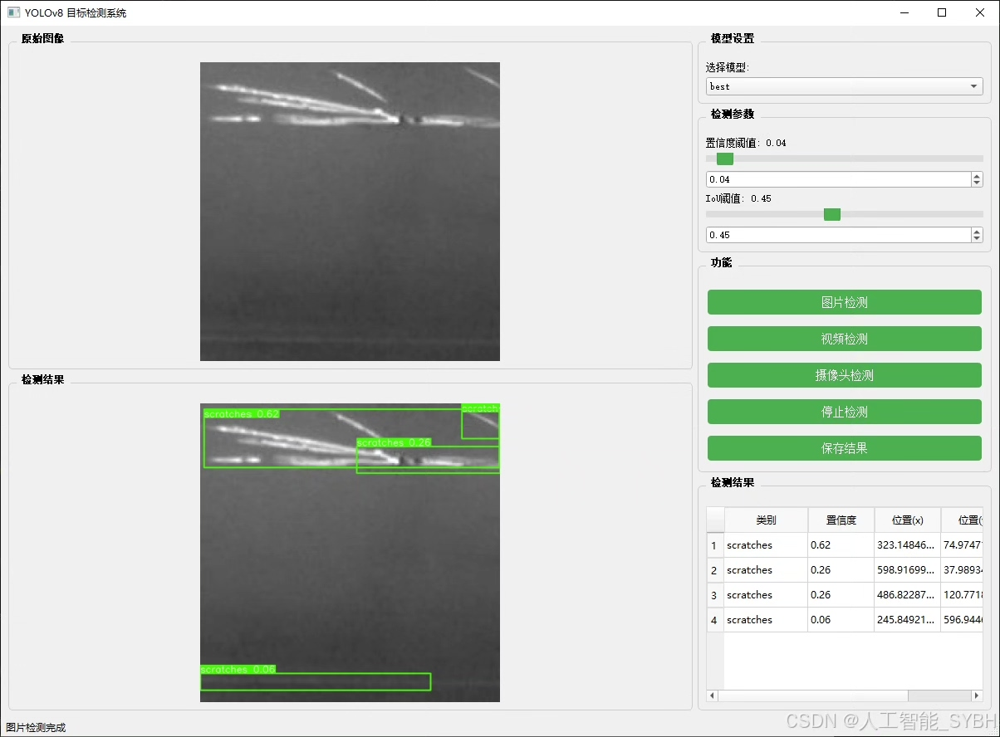
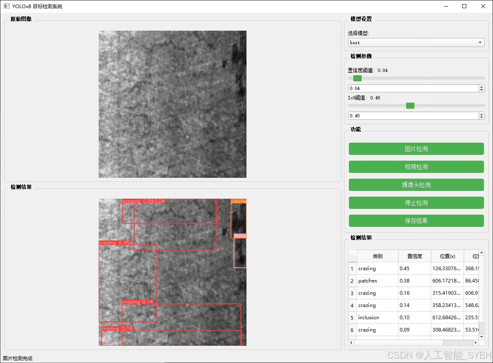
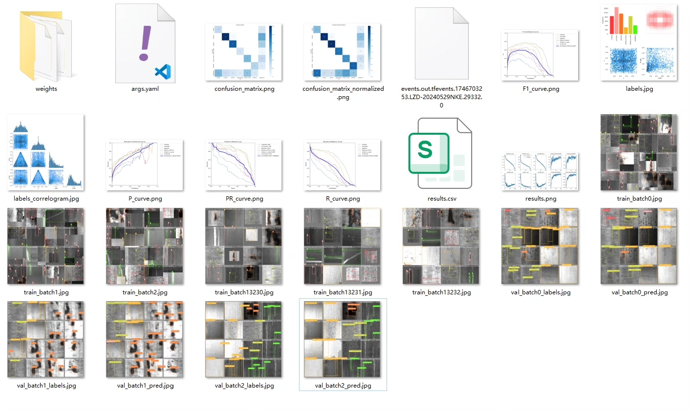
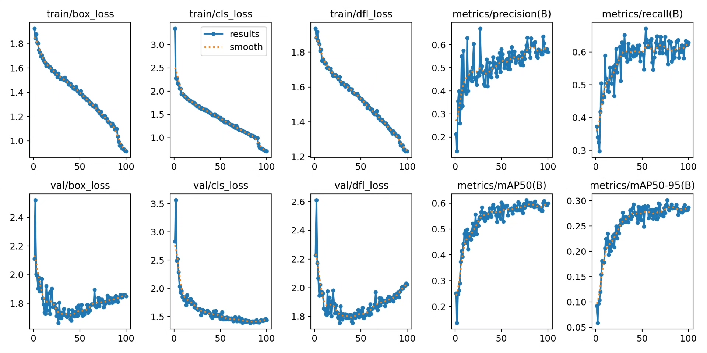
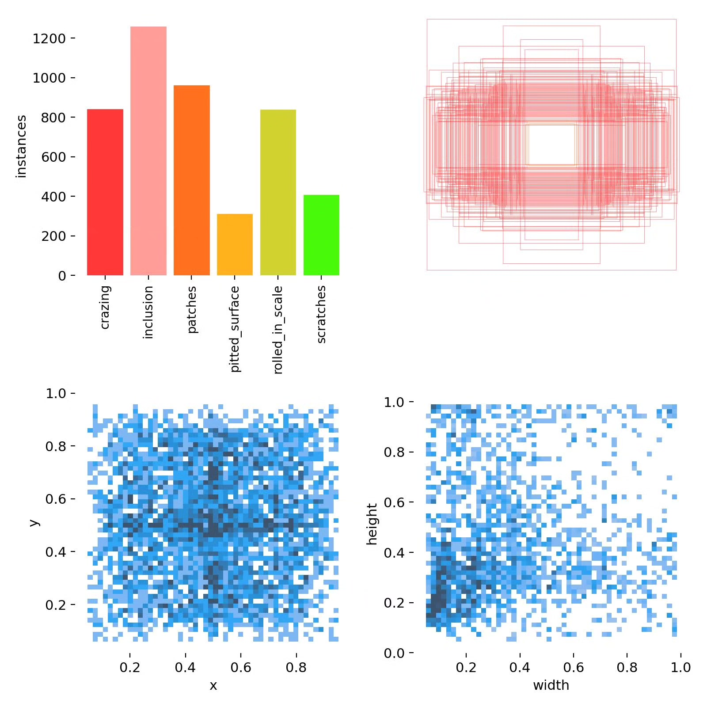
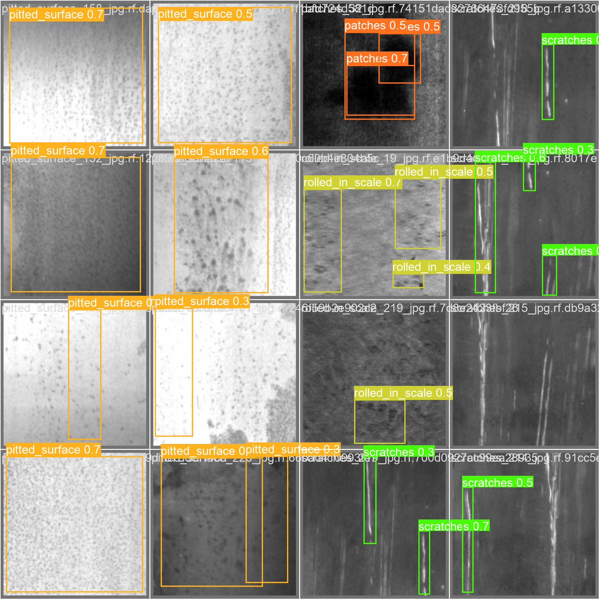
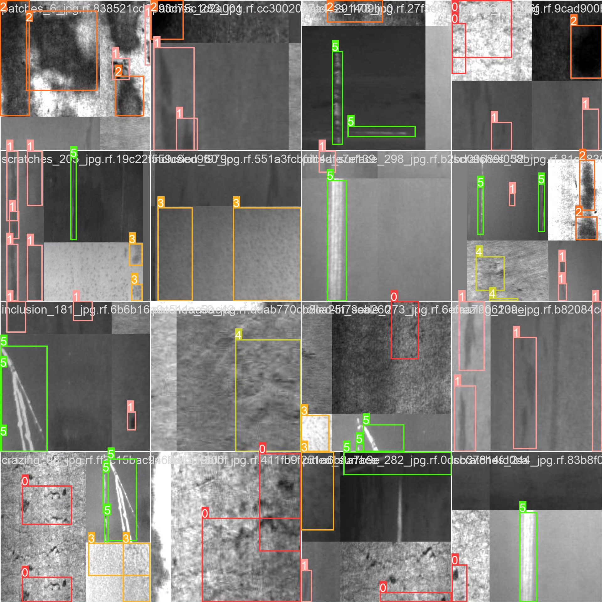
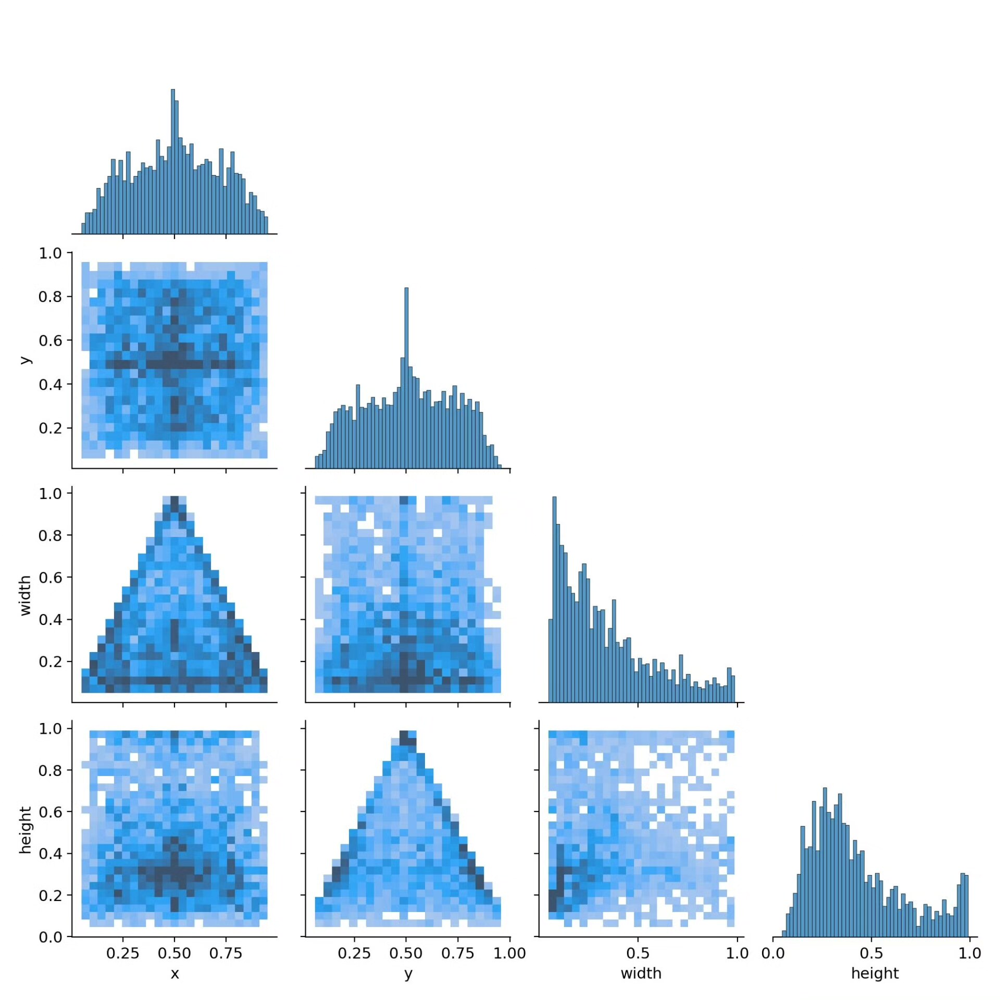

# Steel Surface Defect Target Detection System Based on Deep Learning YOLOv8 (YOLO)

## Body

Based on the YOLOv8 deep learning algorithm, this project has developed a steel surface defect detection system for automatic inspection. It aims to address the limitations of traditional manual inspection methods in terms of efficiency, accuracy, and consistency. The system is designed to identify and locate six common types of steel surface defects (crazing, inclusion, patches, pitted surface, rolled in scale, scratches) with high precision. A total of 2760 labeled images (2352 training set, 295 validation set, and 113 test set) were used for model training and evaluation. Through advanced convolutional neural network architectures and transfer learning techniques, the system achieves real-time detection of minor steel surface defects, with detection accuracy reaching industrial application standards, significantly improving the automation level of steel quality control.

The company's products have obtained YOLO official commercial license certification.

We provide after-sales service.

After payment, we will provide WeChat ID for instant questions.

Environment configuration: We will provide an instruction tutorial for environment setup, and WeChat will provide答疑.

Remote installation service: If you need remote configuration, an additional fee of 69 is required, with all fees refunded if the configuration fails (only refund installation fees for older computers).

Retraining dataset: After setting up the environment, you can train on your own computer. If you need us to retrain, just pay 69 plus computing power fees (2.5 yuan/hour).

Full after-sales service

## Images

## Payment

Here is a pay link on Stripe ( https://buy.stripe.com/3cs8yP7sY87d0vu9AB ). Please contact me lonlonago@foxmail.com after funding $89, and I will send you a complete data files , thank you!

